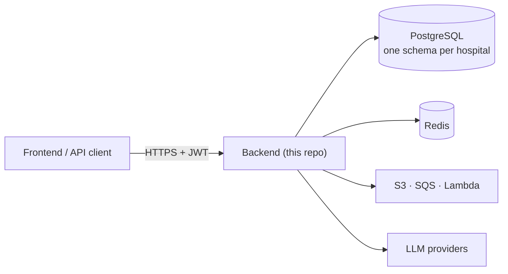

# NoHarm Backend


[](https://github.com/noharm-ai/backend/issues)
[](https://opensource.org/licenses/MIT)
[](https://github.com/noharm-ai/backend/releases)

REST API for the [NoHarm](https://noharm.ai) clinical decision support
platform — an open source system that helps hospital pharmacists prevent
adverse drug events.

## Overview

Medication errors harm patients in every hospital in the world, and a clinical
pharmacist reviewing prescriptions by hand cannot read all of them. NoHarm
reads them instead: it scores every prescription by risk, surfaces the dangerous
ones first, and flags the specific problems in each one — drug–drug
interactions, allergies, doses outside the statistical norm, protocol
violations, results that contradict the prescription.

This repository is the API behind that. It serves the
[NoHarm frontend](https://github.com/noharm-ai/frontend), stores the
pharmacist's decisions, and produces the reports hospitals use to measure the
impact of their pharmacy service.

**Who this is for**

| Audience | What they get |
|---|---|
| Hospitals and health systems | A deployable clinical decision support service, self-hosted or hosted |
| Developers and integrators | A documented REST API to build on and extend |
| Researchers | An open implementation of prioritization and alerting logic for medication safety |

**What it does**

- **Prescription prioritization** — risk scoring that orders the pharmacist's work queue
- **Alerting** — drug interactions, allergies, dose and frequency outliers, tenant-defined protocols
- **Clinical interventions** — recording pharmacist actions and their outcomes
- **Medication reconciliation** — comparing admission and current medication
- **Clinical notes and summaries** — including LLM-assisted summarization
- **Exams and lab results** — the clinical context behind each alert
- **Regulatory solicitations** — approval workflows for controlled requests
- **Reporting** — intervention, economy and audit reports
- **Administration** — users, roles, segments and drug curation

The platform is multi-tenant: each hospital's data lives in its own isolated
PostgreSQL schema.

## Documentation

| Document | Contents |
|---|---|
| [docs/architecture.md](docs/architecture.md) | Architecture and diagrams: layers, request lifecycle, multi-tenancy, authorization, deployment topology |
| [docs/installation.md](docs/installation.md) | Prerequisites, local setup, database, full configuration reference, troubleshooting |
| [docs/user-guide.md](docs/user-guide.md) | Using the API: authentication, tenants, clinical workflows, error handling, FAQ |
| [docs/api.md](docs/api.md) | Endpoint reference |
| [docs/deployment.md](docs/deployment.md) | Self-hosted and serverless deployment, CI/CD, upgrade checklist |
| [CONTRIBUTING.md](CONTRIBUTING.md) | How to fork, patch, test and submit changes |
| [CHANGELOG.md](CHANGELOG.md) | Versioning scheme and release notes |
| [SECURITY.md](SECURITY.md) | Reporting a vulnerability |
| [CODE_OF_CONDUCT.md](CODE_OF_CONDUCT.md) | Community standards |
| [docs/README.md](docs/README.md) | Documentation index |

## Technology stack

| Layer | Technology | Version |
|---|---|---|
| Language | Python | 3.12+ |
| Web framework | Flask | 3.1.3 |
| ORM | SQLAlchemy / Flask-SQLAlchemy | 2.0.51 / 3.1.1 |
| Database | PostgreSQL | 16 (11.6 supported) |
| Database driver | psycopg2-binary | 2.9.12 |
| Cache | Redis | 8.0.1 (client) |
| Authentication | Flask-JWT-Extended | 4.7.4 |
| Request validation | Pydantic | 2.13.4 |
| AI agents | Strands Agents | 1.50.1 |
| LLM providers | Azure OpenAI / OpenAI, Maritaca | — |
| Cloud SDK | boto3 | 1.43.56 |
| Serverless packaging | Zappa | 0.62.1 |
| Tests | pytest (+ flask, cov, order) | 9.1.1 |
| Lint | Ruff | 0.15.8 |

Full pinned lists: [`requirements.txt`](requirements.txt) (development) and
[`requirements-prod.txt`](requirements-prod.txt) (deployment).

## Architecture at a glance

Four layers, one direction of dependency:

```
routes/          →  HTTP handling, parameter parsing, Pydantic request models
services/        →  Business logic, permission checks, orchestration
repository/      →  Database queries
models/          →  SQLAlchemy ORM entities, enums, request schemas
```



Each request authenticates with a JWT, binds the database connection to the
tenant schema carried in the token, runs a permission check, commits, and
returns a uniform response envelope. The details, with sequence and
entity diagrams, are in [docs/architecture.md](docs/architecture.md).

## Quick start

```bash
git clone https://github.com/noharm-ai/backend.git
cd backend

python3 -m venv env && source env/bin/activate
pip3 install -r requirements.txt

make test-setup          # PostgreSQL 16 in Docker, schema and seed data loaded
cp .env.example .env     # then set SECRET_KEY

make dev                 # http://127.0.0.1:5000
```

Requires Python 3.12+, Docker (for the scripted database) and the PostgreSQL
client tools. The complete guide, including manual database setup and the full
environment variable reference, is in
[docs/installation.md](docs/installation.md).

The database schema is maintained in
[`noharm-ai/database`](https://github.com/noharm-ai/database); `make test-setup`
fetches and applies it.

## Testing

Tests require PostgreSQL — SQLite is not compatible with schema-based
multi-tenancy. Use the `make` targets, which set `ENV=test`:

```bash
make test                                           # everything
make test-unit                                      # no database required
make test-integration                               # database required
make test-file FILE=tests/integration/test_drug.py
make test-cov                                       # HTML report in htmlcov/
make lint                                           # ruff, as CI runs it
```

## Project structure

```
backend/
├── mobile.py                 # WSGI entrypoint
├── config.py                 # Environment configuration
├── app/                      # Flask factory, extensions, handlers, security headers
├── routes/                   # Flask blueprints (HTTP layer)
├── services/                 # Business logic
├── repository/               # Database queries
├── models/
│   ├── main.py               # Core ORM models
│   ├── prescription.py       # Prescription models
│   ├── regulation.py         # Regulatory models
│   ├── appendix.py           # Lookup models
│   ├── enums.py              # Enumerations and feature flags
│   └── requests/             # Pydantic request models
├── decorators/               # @api_endpoint, @has_permission
├── security/                 # Roles and permissions
├── agents/                   # LLM agent configuration
├── utils/                    # Dates, status codes, logging
├── exception/                # ValidationError, AuthorizationError
├── tests/                    # unit/ and integration/
├── scripts/                  # Database setup
└── docs/                     # Documentation
```

## Deployment

The application is a plain WSGI app and can be run either way:

- **Self-hosted** — `gunicorn 'mobile:app'` behind a reverse proxy.
- **Serverless** — AWS Lambda + API Gateway via Zappa
  (`zappa_settings.json`), which is how the hosted platform runs.

See [docs/deployment.md](docs/deployment.md).

## Contributing

Contributions are welcome. Branch from `develop`, keep the layering, add tests,
run `make lint && make test`, and open a pull request against `develop`.
[CONTRIBUTING.md](CONTRIBUTING.md) has the details — including the rule that
**no real patient, user or credential data may ever be committed**, in code,
tests or commit messages.

Please read the [Code of Conduct](CODE_OF_CONDUCT.md) before participating, and
[SECURITY.md](SECURITY.md) before reporting anything security-related.

## Related repositories

| Repository | Contents |
|---|---|
| [noharm-ai/frontend](https://github.com/noharm-ai/frontend) | React web application |
| [noharm-ai/database](https://github.com/noharm-ai/database) | PostgreSQL schema and seed data |

## Releases

Versions are numbered `v<MAJOR>.<MINOR>-beta` and released together with the
frontend. Notes for every version are on the
[releases page](https://github.com/noharm-ai/backend/releases); the versioning
policy is in [CHANGELOG.md](CHANGELOG.md).

## License

[MIT](LICENSE) — free to use, modify, self-host and redistribute, including
commercially, with attribution.
