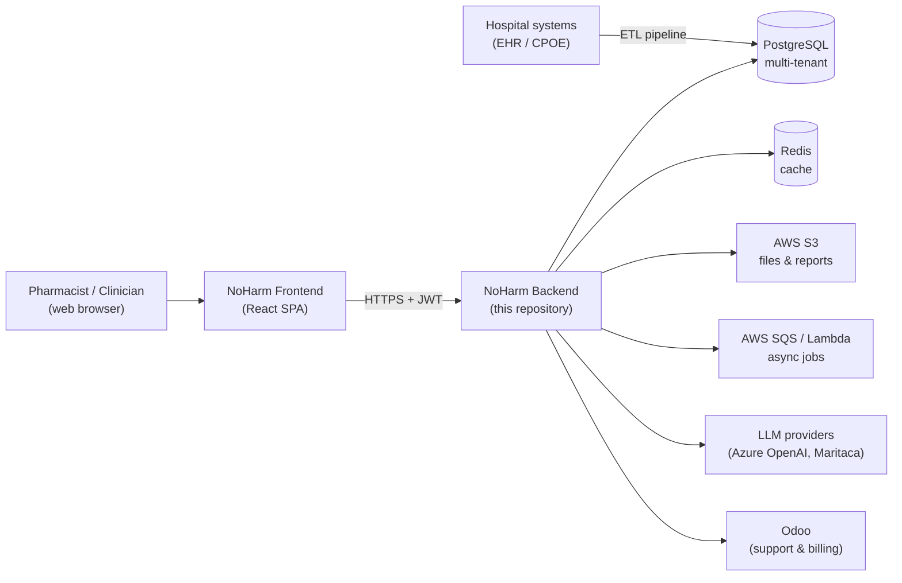
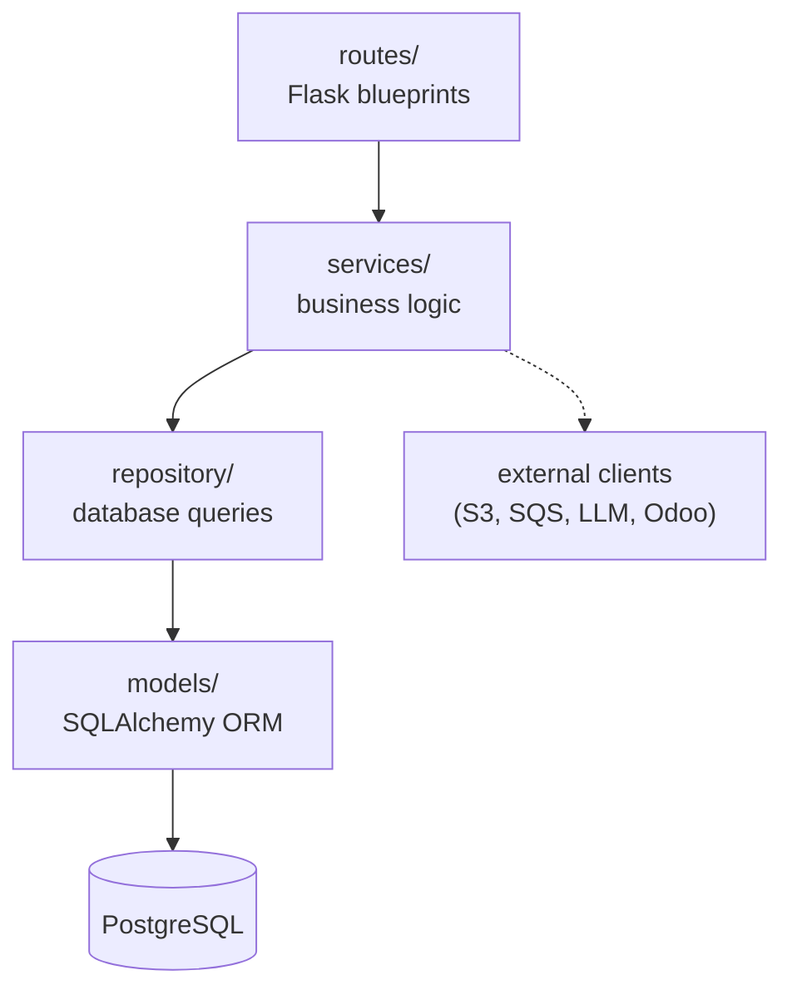
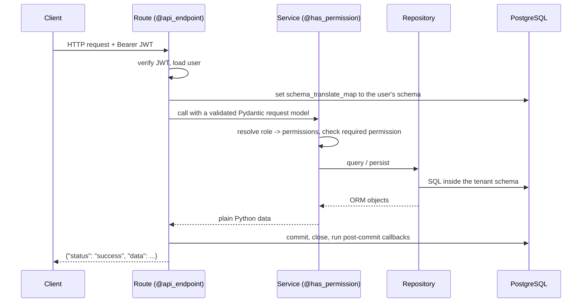
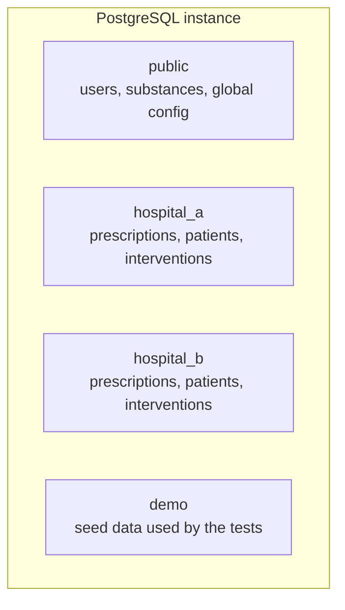
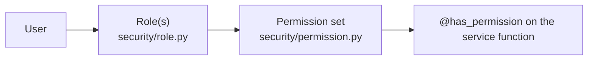
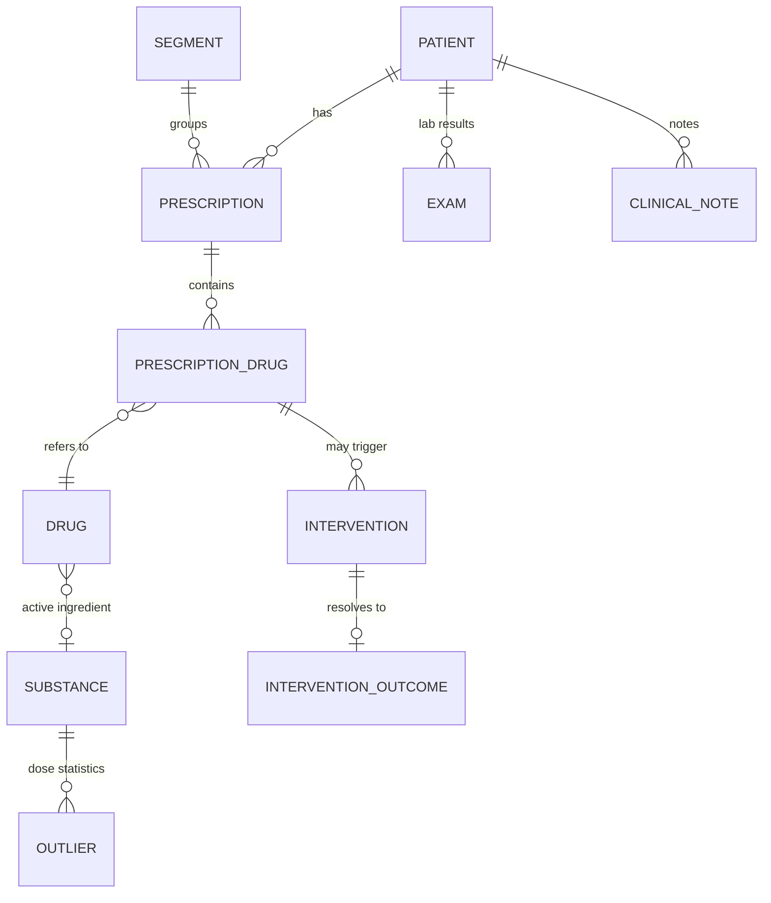
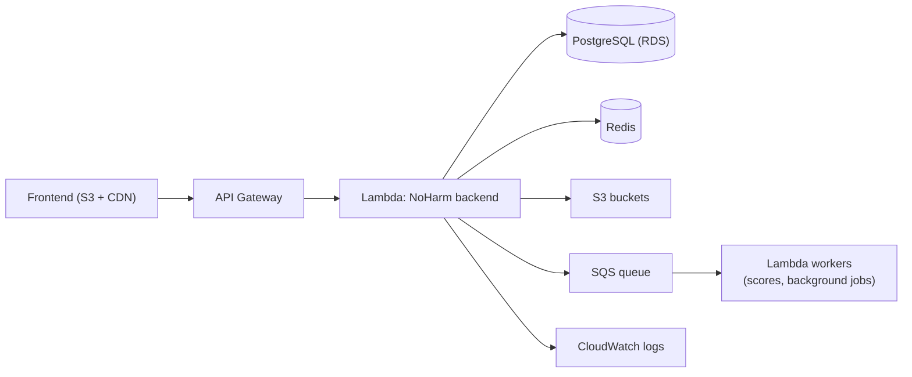

# Architecture

This document describes how the NoHarm backend is put together: the layers a
request travels through, how tenants are isolated, how authorization is
enforced, and how the service is deployed.

It is written for a developer who has never seen the codebase before and needs
to understand it well enough to change it.

## 1. System context

The backend is a REST API. It is one part of a larger clinical decision support
platform.



Clinical data is loaded into the database by an external data pipeline. The
backend reads that data, scores and enriches it, and serves it to the frontend.
It also writes back everything the pharmacist produces: prescription checks,
interventions, clinical notes and regulatory decisions.

## 2. Layered architecture

Every feature is implemented across four layers. Code that crosses a layer
boundary in the wrong direction is considered a defect.



| Layer | Directory | Responsibility | Must not |
|---|---|---|---|
| Routes | `routes/` | Parse HTTP input, build the Pydantic request model, call one service function | Contain business rules or touch the database |
| Services | `services/` | Business logic, permission checks, orchestration, transactions | Build raw HTTP responses |
| Repository | `repository/` | SQLAlchemy queries and persistence | Make authorization decisions |
| Models | `models/` | ORM entities, enums, Pydantic request schemas | Contain business logic |

Supporting directories:

| Directory | Contents |
|---|---|
| `app/` | Flask application factory, extensions, error handlers, security headers, logging |
| `decorators/` | `@api_endpoint` (HTTP envelope) and `@has_permission` (authorization) |
| `security/` | `Permission` and `Role` enumerations, permission resolution |
| `models/requests/` | Pydantic request models, one module per domain |
| `agents/` | Prompt and tool configuration for the LLM agents |
| `utils/` | Date helpers, HTTP status constants, logging, post-commit callbacks |
| `exception/` | `ValidationError`, `AuthorizationError` |
| `tests/` | `tests/unit/` (no database) and `tests/integration/` (database required) |
| `scripts/` | Local database setup and maintenance scripts |

## 3. Request lifecycle

Almost every endpoint is wrapped in two decorators. Together they handle
authentication, tenant selection, authorization, transactions and the response
envelope, so individual endpoints do not repeat that work.



Failure paths are handled in the same place:

| Situation | Response |
|---|---|
| Missing or expired token | `401` with an authentication error |
| Role lacks the required permission | `401` authorization error |
| Pydantic rejects the payload | `400` with a `validations` array |
| Service raises `ValidationError` | The status code and i18n key carried by the error |
| No permission check ran during the request | `401` — a service without `@has_permission` is treated as a bug |

The last row is deliberate: `@api_endpoint` counts permission checks and refuses
to return a successful response if none happened.

## 4. Multi-tenancy

Each client organization (a hospital or a health network) gets its own
PostgreSQL **schema**. A shared `public` schema holds data common to every
tenant — the substance catalog, global configuration and user accounts.



The tenant is never taken from the request body or a query parameter. It comes
from the authenticated user's JWT claims, and the connection is bound to it for
the duration of the request:

```python
db.session.connection(
    execution_options={"schema_translate_map": {None: schema_name}}
)
```

Models are declared without a schema, so the same ORM classes serve every
tenant. A user who belongs to more than one organization switches tenants
through `POST /switch-schema`, which issues a new token for the other schema.

Consequences worth knowing before you write a query:

- A query that hard-codes a schema name breaks multi-tenancy — leave the schema
  implicit.
- Joins between the tenant schema and `public` must name the `public` schema
  explicitly.
- Integration tests run against the `demo` schema.

## 5. Authorization model

Authorization is role-based, resolved per request and enforced in the service
layer.



Roles are coarse job descriptions; permissions are fine-grained capabilities.
The roles currently defined include:

| Role | Purpose |
|---|---|
| `PRESCRIPTION_ANALYST` | Prioritize, analyze and check prescriptions |
| `CURATOR` | Curate drug, substance and score configuration |
| `CONFIG_MANAGER` | Manage segment, exam and score configuration |
| `USER_MANAGER` | Register and edit users of the organization |
| `DISPENSING_MANAGER` | Manage dispensing information |
| `DISCHARGE_MANAGER` | Produce discharge summaries |
| `REGULATOR` | Handle regulatory solicitations |
| `NAVIGATOR` | Patient navigation and care plans |
| `VIEWER` | Read-only access to prescriptions |
| `RESEARCHER` | Access to aggregated, de-identified data |
| `TRAINING` | Access to the training center |
| `SUPPORT_REQUESTER` / `SUPPORT_MANAGER` | Open and manage support tickets |
| `ADMIN` | Full administrative access |
| `ORGANIZATION_MANAGER` | Switch between the schemas of one organization |
| `SERVICE_INTEGRATOR` / `STATIC_USER` | Machine accounts for the data pipeline |

A service function declares what it needs and receives the caller's effective
permissions:

```python
@has_permission(Permission.WRITE_PRESCRIPTION)
def check_prescription(request_data, user_permissions: list[Permission]):
    """Mark a prescription as checked."""
```

Beyond roles, **feature flags** (`models/enums.py::FeatureEnum`, read through
`services/feature_service.py`) turn optional behaviour on per tenant — for
example `CONCILIATION`, `REGULATION`, `CULTURE` or `DISCHARGE_SUMMARY`. A
permission says *who* may act; a feature flag says *whether the tenant bought
that capability at all*.

## 6. Data model overview

The clinical core, simplified:



- **Prescription / PrescriptionDrug** — what was prescribed, and every item in it.
- **Drug / Substance** — the catalog; `Substance` is the active ingredient that
  drives interaction and allergy checking.
- **Outlier** — dose and frequency statistics used to flag unusual prescriptions.
- **Intervention / InterventionOutcome** — the pharmacist's action and its result.
- **Segment** — a hospital unit; most configuration is per segment.
- **Exams, ClinicalNotes** — the clinical context shown next to a prescription.

Schema migrations are **not** managed by this repository. The SQL that creates
and evolves the database lives in
[`noharm-ai/database`](https://github.com/noharm-ai/database), which is also what
CI and the local test setup load.

## 7. Clinical logic worth knowing

| Concern | Where | What it does |
|---|---|---|
| Prioritization | `services/prioritization_service.py` | Scores prescriptions by risk so the pharmacist sees the most dangerous ones first |
| Drug interactions | `services/alert_interaction_service.py` | Substance-level interaction checking with severity levels |
| Other alerts | `services/alert_service.py`, `alert_protocol_service.py` | Allergies, lab-based alerts, tenant-defined protocols |
| Outlier detection | `services/outlier_service.py` | Statistical dose/frequency outliers |
| Conciliation | `services/conciliation_service.py` | Medication reconciliation between admission and current prescription |
| Clinical summaries | `services/clinical_notes_service.py`, `llm_service.py`, `agents/` | LLM-assisted summarization of clinical notes |

## 8. Runtime and deployment topology

The application is packaged as an AWS Lambda function fronted by API Gateway,
deployed with [Zappa](https://github.com/zappa/Zappa) (`zappa_settings.json`).



Nothing in the application code is Lambda-specific: `mobile.py` is an ordinary
WSGI entrypoint, so the same code runs behind any WSGI server. See
[deployment.md](deployment.md) for both options.

Operational characteristics to keep in mind:

- **Connection pool** — pool size 20, max overflow 30, recycle 250 s, pre-ping
  enabled. Long-running queries exhaust the pool; keep requests short.
- **Redis** — 2 s timeout, TLS. Use it for caching only, never as a store of
  record.
- **Cold starts** — the first request after a deployment pays Lambda
  initialization cost; a keep-warm schedule mitigates it.
- **Timezone** — the process runs in `America/Sao_Paulo`; use the helpers in
  `utils/dateutils.py` rather than naive `datetime.now()`.

## 9. Where to go next

- [installation.md](installation.md) — get it running locally
- [user-guide.md](user-guide.md) — call the API as a client
- [api.md](api.md) — endpoint reference
- [deployment.md](deployment.md) — ship it
- [../CONTRIBUTING.md](../CONTRIBUTING.md) — change it
