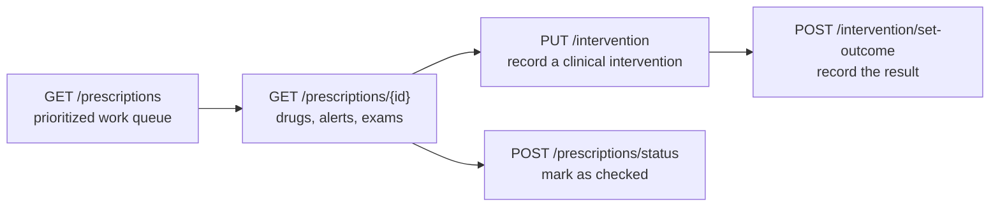

# User guide (API clients)

This guide is for developers integrating with a running NoHarm backend: how to
authenticate, how the multi-tenant model affects every call, and how to carry
out the common clinical workflows. For the complete endpoint list see
[api.md](api.md).

The end users of the platform — pharmacists and clinicians — interact with the
[NoHarm frontend](https://github.com/noharm-ai/frontend), whose own user guide
covers the screens.

## 1. Conventions

Base URL: whatever host the instance runs on. Locally,
`http://127.0.0.1:5000`.

Every response uses the same envelope.

**Success**

```json
{ "status": "success", "data": { } }
```

**Error**

```json
{ "status": "error", "message": "Human-readable message", "code": "error.key" }
```

**Validation error**

```json
{ "status": "error", "message": "Parâmetros inválidos", "validations": [ ] }
```

`code` is a translation key, so a client can localize the message instead of
displaying the server text. Messages produced by business rules are written in
Brazilian Portuguese, which is the platform's primary language.

## 2. Authentication

### Get a token

```bash
curl -X POST https://<host>/authenticate \
  -H 'Content-Type: application/json' \
  -d '{
        "email": "fulano@example.com",
        "password": "<password>",
        "schema": null,
        "extraFeatures": []
      }'
```

The response carries an `access_token` and a `refresh_token`. Send the access
token on every subsequent call:

```
Authorization: Bearer <access_token>
```

Access tokens are short-lived (20 minutes by default) and refresh tokens last
30 days. Refresh before expiry rather than re-authenticating:

```bash
curl -X POST https://<host>/refresh-token \
  -H 'Authorization: Bearer <refresh_token>'
```

Instances configured for OAuth use `GET /auth-provider/<schema>` to discover the
provider and `POST /auth-provider` to exchange the provider's response for a
NoHarm token.

### Tenants (schemas)

Every user belongs to an organization, and each organization has its own
database schema. The schema is encoded in the token — it is never a request
parameter, and there is no way to read another tenant's data with a token
issued for yours.

Users who belong to more than one organization can list and switch:

```bash
curl https://<host>/switch-schema -H "Authorization: Bearer $TOKEN"
curl -X POST https://<host>/switch-schema \
  -H "Authorization: Bearer $TOKEN" \
  -H 'Content-Type: application/json' \
  -d '{"schema": "<target-schema>"}'
```

Switching returns a new token. Discard the old one.

### Permissions

Each endpoint requires a permission, granted through the caller's role
(`PRESCRIPTION_ANALYST`, `CONFIG_MANAGER`, `VIEWER`, …). A call that the role
does not cover returns `401` regardless of whether the data exists. See
[architecture.md, section 5](architecture.md#5-authorization-model).

Some capabilities are also gated per tenant by feature flags — conciliation,
regulation, discharge summaries and the culture card among them. When a feature
is off, the related endpoints return empty data rather than an error.

## 3. Core workflow: prioritize, review, act

The pharmacist's day maps onto four groups of endpoints.



### Step 1 — list the work queue

```bash
curl -G https://<host>/prescriptions \
  -H "Authorization: Bearer $TOKEN" \
  --data-urlencode 'idSegment=1' \
  --data-urlencode 'startDate=2026-09-01'
```

Results are ordered by a computed risk score, so the most dangerous
prescriptions surface first. Filters include segment, department, date range,
and the presence of specific alerts — see
[api.md](api.md#get-prescriptions--query-parameters) for the full list.

### Step 2 — open one prescription

```bash
curl https://<host>/prescriptions/<idPrescription> \
  -H "Authorization: Bearer $TOKEN"
```

The payload is everything needed to make a decision: the prescribed items, the
alerts raised against them (interactions, allergies, dose outliers, protocol
violations), recent lab results, and the patient's clinical context.

### Step 3 — record an intervention

```bash
curl -X PUT https://<host>/intervention \
  -H "Authorization: Bearer $TOKEN" \
  -H 'Content-Type: application/json' \
  -d '{
        "idPrescriptionDrug": "12345",
        "idPrescription": "0",
        "idInterventionReason": 3,
        "error": false,
        "observation": "Dose adjustment recommended",
        "status": "s"
      }'
```

Reason categories come from `GET /intervention/reasons`. To apply the same
intervention to several items at once, send `idPrescriptionDrugList` instead of
`idPrescriptionDrug`.

### Step 4 — close the loop

```bash
curl -X POST https://<host>/prescriptions/status \
  -H "Authorization: Bearer $TOKEN" \
  -H 'Content-Type: application/json' \
  -d '{"idPrescription": "12345", "status": "s"}'
```

Once the prescriber responds, record the result of the intervention with
`POST /intervention/set-outcome` (use `GET /intervention/outcome-data` first to
retrieve the fields the form needs). Outcomes are what the economy and
intervention reports are built from.

## 4. Other common tasks

| Task | Endpoints |
|---|---|
| Search a patient | `GET /prescriptions/search?term=`, `POST /patient/list` |
| Update patient data (weight, allergies) | `POST /patient/<admissionNumber>` |
| Medication reconciliation | `GET /conciliation/...` (requires the `CONCILIATION` feature) |
| Clinical notes and AI summaries | `/prescriptions/<id>/clinical-notes`, `/summary/...` |
| Drug configuration and curation | `/drugs/...`, `/substance/...` (admin permissions) |
| Reports and exports | `/reports/...` |
| Regulatory solicitations | `/regulation/...` (requires the `REGULATION` feature) |
| Async job status | `GET /queue/status/<requestId>` |

## 5. Long-running operations

Report generation and score recalculation are asynchronous. The endpoint
returns a request identifier; poll `GET /queue/status/<requestId>` until it
reports completion. Do not hold an HTTP connection open waiting for them.

## 6. Error handling in clients

| Status | Meaning | What the client should do |
|---|---|---|
| `400` | Invalid parameters — inspect `validations` | Fix the payload; show the field errors |
| `401` | Missing/expired token, or insufficient permission | Refresh the token; if it persists, the role lacks the permission |
| `404` | Endpoint or record not found | Check the path and the identifier |
| `500` | Unhandled server error | Retry once, then report it with the timestamp |

Treat `401` on a refreshed token as an authorization problem, not an
authentication one — the two share a status code.

## 7. FAQ

**Can I query another organization's data?**
No. The tenant comes from the token, and the database connection is bound to
that schema for the whole request.

**Why did a valid-looking call return an empty list instead of an error?**
Most likely the corresponding feature is not enabled for that tenant, or the
segment filter excludes the data. Features are per-tenant configuration, not
request parameters.

**Are messages available in English?**
The API returns a translation `code` alongside every error message; clients
localize from that. The stored message text is Portuguese, the platform's
primary language. The frontend ships both Portuguese and English.

**Which date and timezone rules apply?**
The server runs in `America/Sao_Paulo`. Send ISO-8601 dates; expect responses in
the same timezone.

**Is there an OpenAPI/Swagger document?**
Not at the moment. [api.md](api.md) is the reference, generated from the route
definitions in `routes/`.

**How stable is the API?**
Backward-compatible changes ship continuously. Breaking changes are announced in
the [release notes](https://github.com/noharm-ai/backend/releases). Pin the
frontend and backend to matching minor versions.

**Can I run my own instance?**
Yes — the project is MIT licensed. See [installation.md](installation.md) and
[deployment.md](deployment.md). You will also need the database schema from
[`noharm-ai/database`](https://github.com/noharm-ai/database) and a data feed
from your own hospital systems.

**Where do I report a bug or ask a question?**
Open an issue at
<https://github.com/noharm-ai/backend/issues>. For anything that looks like a
security vulnerability, follow [SECURITY.md](../SECURITY.md) instead of filing a
public issue.
